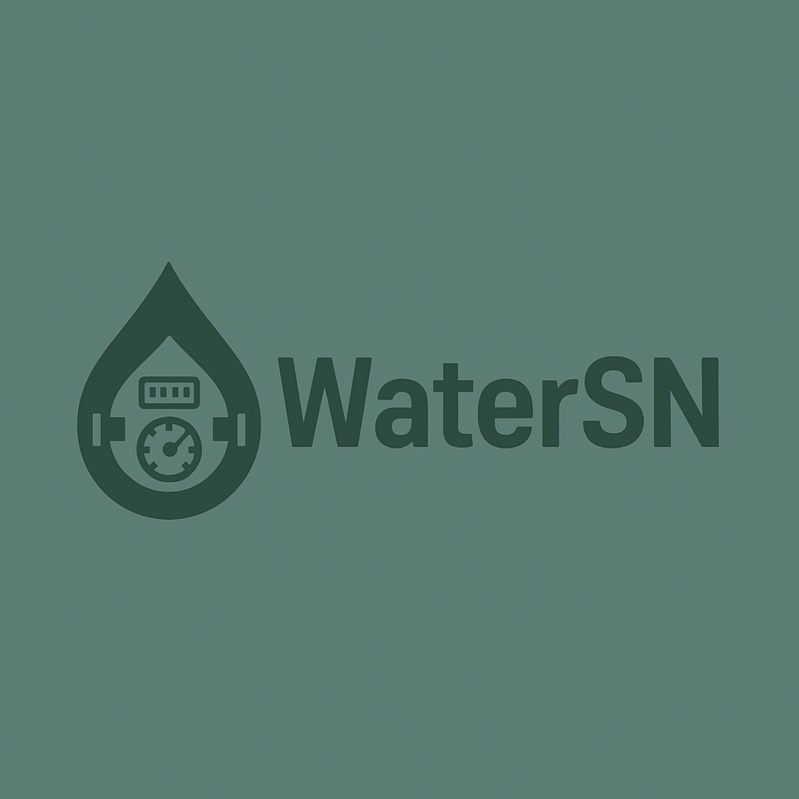

  

<h1 align="center">WaterSN</h1>

  
  
  
  
  

## Overview

**WaterSN** is a modern, modular desktop application for water billing and management, designed for water utilities and local authorities. It provides a secure, user-friendly interface for managing clients, billing, meter readings, and more.

## Features

- **Authentication**: Secure login, password reset by email, default admin user
- **User Management**: Roles, permissions, and user CRUD
- **Client Management**: Add, edit, and search clients
- **Meter Management**: Register and track water meters
- **Billing**: Generate, view, and export water bills
- **Payments**: Record and track payments
- **Statistics & Charts**: Visualize consumption and revenue
- **Alerts**: System notifications and reminders
- **Modern UI/UX**: Responsive, branded interface with logo
- **MySQL Database**: Robust, scalable data storage
- **Native Email Sending**: SMTP/SSL for password reset (no external libs)

## Technologies Used

  
  
  
  
  

## Project Structure

- `main.cpp` — Application entry point
- `watersn.cpp/.h/.ui` — Main window and UI
- `widgets/` — All UI components (login, reset, dashboard, etc.)
- `model/` — Data models
- `controller/` — Business logic
- `utils/` — Utilities (mail, bcrypt, etc.)
- `data/` — SQL schema and seed data

## Getting Started

1. **Clone the repository**
2. **Configure your MySQL database** (see `data/WaterSN_schema.sql`)
3. **Configure SMTP settings** in the code for password reset
4. **Build with CMake and Qt 6.9.1**
5. **Run the application**

## License

MIT License

---

<i>Made with ❤️ by gayensis for water management professionals</i>

